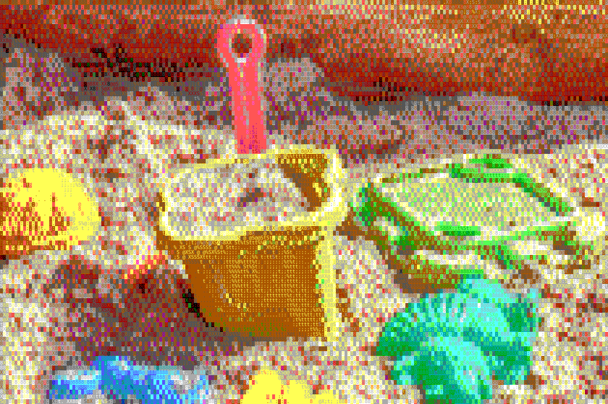

# sandbox

A personal sandbox repository for learning, experimentation, and project incubation. This space serves as a playground
for:

- 📚 Learning
- 🌱 Nurturing new ideas
- 🧑‍🔬 Experiments and POCs
- 🧑‍💻 Having fun building!

Projects here are in various stages of development—from initial concepts to completed utilities. Some may graduate to
their own repositories, while others might remain here for posterity.
